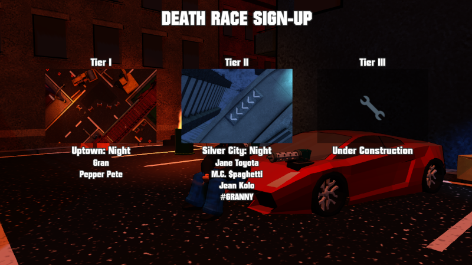

# Death Race  
  
  
  
This is a FREE game.  
Made in [Godot](https://github.com/godotengine/godot) 3.5.3, the open-source alternative to engines like Unity.

[RELEASE DOWNLOAD](https://github.com/Dark-Gran/Death-Race/releases/tag/v0.1-alpha)  
(Soundless)  
  
**Controls:**  
- Keyboard.  
  
## About Project  
  
The game attempts to recapture the driving feel of old Rockstar games like Death Rally or GTA1&2 while utilizing a modern newtonian physics engine.  
  
The tournament base, which gives an otherwise arcade game more serious feeling, is to be built upon to expand both gameplay (eg. choice of weapons) and atmosphere (storytelling).  
  
## Todo  
  
_- Menus Upgrade (Out-of-Race GUI)_  
_- Weapon Shop_  
_- More Tracks & Cars (incl. Tier III)_  
_- Sound & Music_  
_- Storyline (incl. Cutscenes)_  
_- Gameplay polish_  

## Todo (Based on reception)
_- More weapons_  
_- Car Customization_  
_- More Quests_  
_- More Tracks & Cars_  
_- Multiplayer_  
  
## Credits  
  
Thanks to my friends who made some of the models (eg. all vehicles except for the very first car).  
  
## Screenshots  
  
  
---  
  
---  
  
---  
  
---  
  
  
