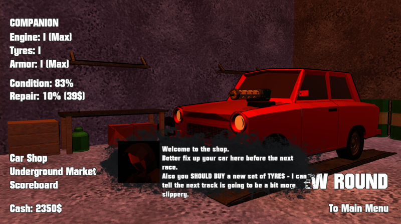

# Death Race  
  
  
  
This is a FREE demo.  
(Full beta yet to be released.)  
  
Made in [Godot](https://github.com/godotengine/godot) 3.5.3, the open-source alternative to engines like Unity.

[ALPHA RELEASE DOWNLOAD](https://github.com/Dark-Gran/Death-Race/releases/tag/v0.1)  
(Soundless)  
  
**Controls:**  
- Keyboard.  
  
## About Project  
  
The game attempts to recapture the driving feel of old Rockstar games like Death Rally or GTA1&2 while utilizing a modern newtonian physics engine.  
  
The tournament base, which gives an otherwise arcade game more serious feeling, is to be built upon to expand both gameplay (eg. choice of weapons) and atmosphere (storytelling).  

The code is open-source, excluding the assets.  
  
## Todo for Beta  
  
_- Gameplay: Higher speeds_  
_- Menus Upgrade (Out-of-Race GUI)_  
_- Underground market (eg. mines)_  
_- More Tracks & Cars (incl. Tier III)_  
_- Sound & Music_  

## Todo (Based on reception)
_- Port to Godot 4.x or Unity_  
_- Storyline (incl. Cutscenes)_  
_- "Final boss race"_  
_- Choice of Weapons_  
_- Car Customization_  
_- More Quests_  
_- More Tracks & Cars_  
_- Mobile version_  
_- Multiplayer_  
  
## Credits  
  
Thanks to my friends who made some of the models (eg. all vehicles except for the very first car).  
  
## Screenshots  
  
  
---  
  
---  
  
---  
  
---  
  
---
  
  
